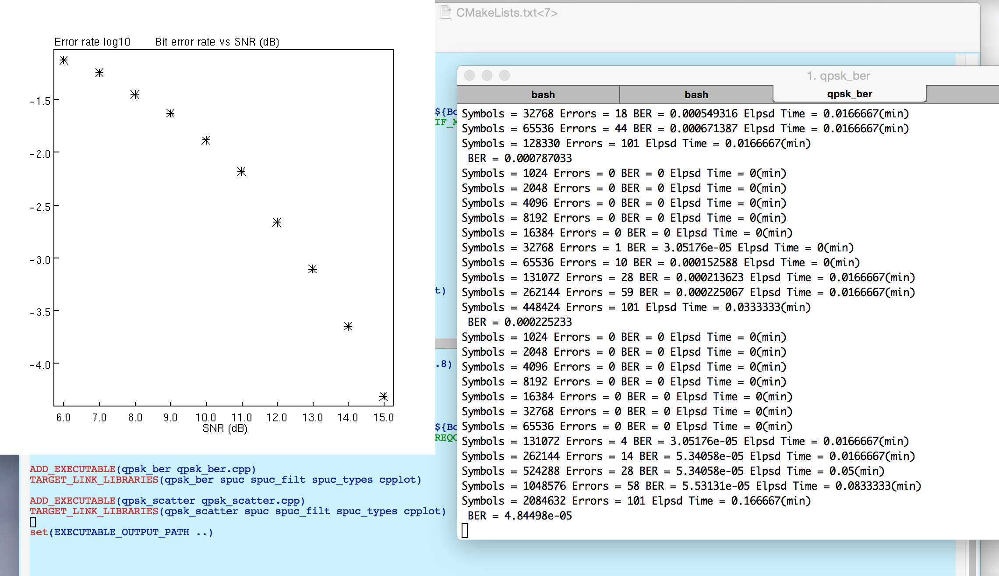

SPUC - Signal Processing Using C++
=================

### Build status - Mac Os X, clang

This is an update of code that has been on sourceforge for about 14 years. The genesis of this code goes back even further - before decent C++ template support and availability of a useful complex class.

**Note: boost no longer required, unless building python extensions**

**Also most files now use MIT License (check each file)**

For a lite-weight version please checkout spuclib instead as it does not have the Doxygen generated files like this does.

Nor does spuclib have the examples or the python extensions available in audiofilter/pyspuc

More documentation pages here (out of date)

http://audiofilter.github.io/spuc/
[http://audiofilter.github.io/spuc/]

### Various Sub-projects also on Github

PYSPUC - python bindings for spuclib
 

SPUCLIB - CMake build of various libraries without examples, etc

SPUC_QPSK - QPSK simulation

SPUC_FIXED - Fixed point class similiar to SystemC

SPUC_FILTER - Demo of QT based GUI filter design based on SPUCLIB

Since the code on sourceforge, has not compiled for modern compilers for several years, this update fixes compiler errors and other bugs found in more real-life testing. Also various parts have been updated/upgraded.

For now this is merely an update and is lacking in other documentation and / or examples.

In addition to very very basic examples, there are some in graphic_examples that can be compiled and display data using OpenGL
For this purpose the cpplot project files are added as a subdirectory.
This should work fine on a Mac if you have Boost installed.
The examples display impulse responses for various filters.
There is also an example that display BER for an MLSE Equalizer as noise is added to the input.

Travis is being used to display the build integrity and uses Clang on Mac OSX 10.9. However, this should also work fine with GCC 4.8

